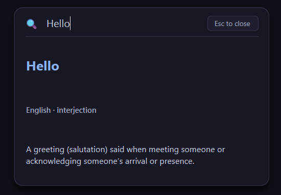

# QuickMeaning 🔍

**QuickMeaning** is a minimal Windows desktop background utility that lets you look up word meanings and pronunciations instantly using a global keyboard shortcut.

---

## 📸 Screenshot



---

## ✨ Features

- **Global Shortcut**: Press `Ctrl + Shift + M` anywhere in Windows to trigger the search popup.
- **Clean Input State**: Search input field clears automatically every time the window is reopened.
- **Keyboard & Mouse Control**:
  - Press `Enter` to submit search.
  - Press `Esc` or click the **Esc to close** badge to dismiss the window.
- **Fixed & Draggable Palette**: A compact, fixed-size command palette (`420 × 300 px`) that can be dragged by clicking and holding the header or frame.
- **Scrollable Results Area**: Result display area wraps long definitions and scrolls vertically when needed.
- **Multilingual Support**: Lookup support for English as well as foreign-language words (*bonjour*, *fille*, *schadenfreude*).
- **Article Normalization**: Automatically strips leading articles (e.g., `La fille` → `fille`) and handles phrasal queries.
- **Smart Relevancy Scoring**: Automatically prioritizes primary dictionary definitions while filtering out obscure Translingual or ISO language code entries.

---

## ⚙️ How It Works

1. QuickMeaning runs quietly in the background with a system tray icon.
2. Pressing `Ctrl + Shift + M` triggers a thread-safe signal that centers and focuses the frameless command palette popup.
3. Single-word queries first check the **Free Dictionary API** for English definitions and IPA phonetics.
4. If unavailable or when searching foreign words, the query falls back to the **Wiktionary REST API**, applying article normalization and relevancy scoring to deliver the best definition.

---

## 🚀 Getting Started

### Prerequisites

- Windows 10 or 11
- Python 3.10+ installed and added to PATH

### Installation

Clone the repository and set up a Python virtual environment:

```cmd
git clone https://github.com/Amitkumar-21/QuickMean.git
cd QuickMean
python -m venv mean
mean\Scripts\activate
pip install -r requirements.txt
python main.py
```

---

## 🎯 Usage

1. Start QuickMeaning by running `python main.py` or double-clicking `dist/QuickMeaning.exe`.
2. Press **`Ctrl + Shift + M`** from any active application (browser, PDF reader, IDE, text editor).
3. Type any word or phrase (e.g., `ask`, `serendipity`, `bonjour`, `La fille`).
4. Press **`Enter`** to view part of speech, pronunciation, language, and definition.
5. Press **`Esc`** or click **Esc to close** to hide the popup.

---

## 🛠️ Tech Stack

- **Python**: Core application language
- **PySide6**: Qt framework for desktop UI
- **pynput**: Global hotkey listener
- **httpx / urllib**: Network requests for dictionary APIs
- **Free Dictionary API**: Primary English definitions & IPA phonetics
- **Wiktionary REST API**: Multilingual lookup fallback engine
- **PyInstaller**: Standalone Windows executable packaging

---

## 📦 Build Instructions

To compile QuickMeaning into a standalone single-file Windows executable (`dist/QuickMeaning.exe`):

```cmd
python build.py
```

The script cleans previous build caches and outputs the compiled executable at `dist/QuickMeaning.exe`.

---

## 📁 Project Structure

```text
QuickMeaning/
├── main.py               # Application entry point & system tray manager
├── ui.py                 # PySide6 fixed-size, draggable command palette UI
├── dictionary.py         # Free Dictionary API & Wiktionary scoring logic
├── hotkey.py             # Global hotkey listener (pynput + Qt Signals)
├── config.py             # Configuration constants, colors, & dimensions
├── build.py              # PyInstaller automated build script
├── rthook_six_patch.py   # PyInstaller runtime hook for Python 3.12 compatibility
├── QuickMeaning.spec     # PyInstaller configuration specification
├── requirements.txt      # Project dependencies
├── assets/               # Application icons & UI screenshot (icon.png, icon.ico, screenshot.png)
└── README.md             # Project documentation
```

---

## 🔮 Future Ideas

- **Selected-Text Lookup**: Automatically populate search with currently highlighted text.
- **Customizable Hotkey**: Allow users to configure shortcut key combinations.
- **Context-Aware Explanations**: Provide AI/LLM-powered contextual definitions.
- **Word History**: Track recently searched words and definitions.
- **Offline Dictionary Support**: Local SQLite/Stardict dictionary fallback.

---

## 📄 License

This project is licensed under the MIT License.
